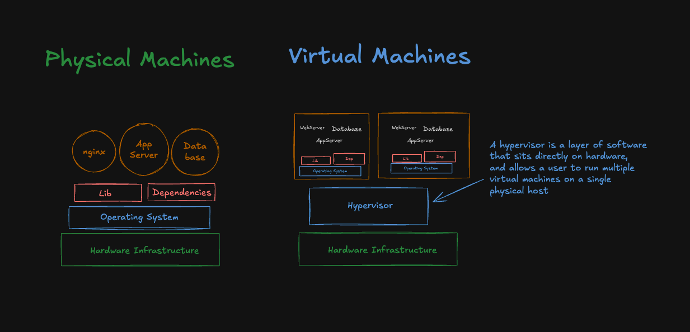

# Inception

## Why Docker?

### Pain Point

- Installation & Configuration
  - Time Consuming
  - Need to perform installation and configuration on every server and every environment
- Compatibility & Dependency
  - Need to keep resolving issues related to libraries and dependency
- Inconsistencies across environment
  - Hard to track changes across environment.
- Operational Support
  - WHen a new developer joins the team, It takes a lots of time to provision the development environment.



## Advantage of Docker

- Flexible - Complex apps can be easily to containerized.
- LightWeight - Containers use fewer resources than virtaul machines.
- Portable - You can build locally, deploy to the cloud and run anywhere.
- Loosely Coupled - Replace or upgrade containers without affecting others.
- Scalable - Easy to scale containers across data center.
- Secure - Containers provide isolation without extra setup.

## Docker Architecture

- Docker Daemon
  - Listens for Docker API requests and manges Docker objects such as images, container, networks and volumes
- Docker Client
  - Can be present on either Docker Host or any other machine (local desktop)
- Docker Images
  - An image is a **read-only-template** with **instruction for creating a Docker container**.
  - An image is based on another image with some additional cuztomization.
- Docker Containers
  - A container is a runnable instance of an image.
  - We can create,start,stop,move,delete a container using the Docker API or CLI
  - We can connect a container to one or more networks attach storage to it, or even create a new image based on its current state
  - When a container is removed, any changes to its state that are not stored in **presistent storage disappear**.

## Docker Command (Basic)

- **Pull** Docker Image from Docker Hub
  `docker pull <image_name:version>`
- **Run** Docker Container
  `docker run --name <container_name> -p <host_port:container_port> -d <image_name:tag_number>
- **Start** and **Stop** Docker Containers
  `docker start <app_name>`
  `docker stop <app_name>`
- **Remove** Docker Containers
  `docker rm <app_name>`
  `docker rm -f $(docker ps -aq)`
- **Remove** Docker Images
  `docker rmi <image_name>`
  `docker rmi $(docker images -q)`
- **Prune**

```bash
# Only "dangling" images (untagged images like <none>:<none>)
docker image prune

# Remove all unused images (including tagged ones)
docker image prune -a

# Prune Container with force (no confirmation):
docker container prune -f
```

### List Docker Containers

```bash
# List only running containers
docker ps

# List every containers (including the stop ones)
docker ps -a

# List only containers IDS
docker ps -q

# Format
docker ps --format "table {{.Image}}\t{{.Names}}\t{{.Status}}\t{{.ID}}\t{{.Ports}}"
```

### Connect to Docker Container via command line

```bash
# Connect to the container's terminal
# i - interactive
# t - tty
docker exec -it <container_name> /bin/sh

# Example of exec command directly
docker -exec -it <container_name> ls

# Check listening port
netstat -lntp
```

## Dockerfile

- A set of instruction to build a Docker Image
- Automates the process of creating Dicker images by specifying steps which are called `Instruction`
- Example:
  - Install software
  - Copy files
  - Set ENV
  - Run Commands

### Build Docker Image from Dockerfile

```bash
# Build Docker Image
docker build -t <custom_image_name:tag> .

# Run Docker Container
docker run --name myapp1 -p 8080:80 -d <image_name:tag>

# List the port we are using in our laptop
sudo lsof -i -P -n | grep LISTEN
```

### Push Docker Image to Docker Hub

```bash
# List Docker images
docker images

# Tag Docker image
docker tag <image_name:tag> DOCKER_USERNAME/<image_name:tag>

# Push image
docker push DOCKER_USERNAME/<image_name:tag>
```

### LABEL Instruction

- What is Label instruction in Dockerfile?
  - Adds metadata to an image
  - An image can have more than one label
  - Labels included in the base image are inherited by your image
  - If a label already exists but with different value, the most-recent-applied value **overides** any previous-set value.

```Dockerfile
# Custom Labels
LABEL maintainer="Nonthakorn Non"
LABEL version="1.0"
LABEL description="A simple Nginx Application"

# OCI Labels (Open Container Initiative)
LABEL org.opencontainers.image.authors=""
LABEL org.opencontainers.image.title=""
LABEL org.opencontainers.image.description=""
LABEL org.opencontainers.image.version=""
LABEL org.opencontainers.image.revision=""
LABEL org.opencontainers.image.created=""
LABEL org.opencontainers.image.url=""
LABEL org.opencontainers.image.source=""
LABEL org.opencontainers.image.documentation=""
LABEL org.opencontainers.image.vendor=""
LABEL org.opencontainers.image.licenses=""
```

### COPY vs ADD

- What is COPY?
  - The COPY instruction copies new files or directories from `src` and adds them to the file system of the image at that path `dest`
  - Files and directories can be copied from the build context, build stage, named context, an image
  - Cannot extract file
  - Preferred for all local file copies
- What is ADD?
  - It copies new files or directories from `src` and adds them to the filesystem of the image at the path `dest`
  - Files and directories can be copied from the build context, remote URL, Git repository
  - Automatically extract a zip file
  - Use only for tar extraction or URL fetching
  - Docker does not extract `.zip` `.rar` `.7z`

### ARG

- What is ARG
  - Defines a variable that users can pass at build-time to the builder with
    - `docker build`
    - using the flag can override on Dockerfile
    - `docker build --build-arg NGINX_VERSION=1.27 -t my-app:v1 .`
    - `ENV` variables always overrides ARG variables (if same variable defined in both places)

> Variable exists during build, then disappears.

### RUN and EXPOSE

- What is RUN?
  - It will execute any commands to create a new layer on top of the current image
  - The added layer is used in the next step in the Dockerfile
  - Cache invalidatoin for RUN instruction: Is not validated automatically during nex build
  - The cache for RUN instruction can be invalidate by using `--no-cache` flag
    - `--no-cache` - Don't store the package index cache (keeps image smaller)
- What is EXPOSE
  - Informs Docker that the cotainer listens on the specified network ports at runtime
  - Can you if you want to EXPOSE ond UDP or TCP
    - `EXPOSE 80/udp`
    - `EXPOSE 80/tcp`

### ENV, CMD and WORKDIR

- What is ENV?
  - EVV sets the environment variable
  - ENV is persisted in the final image and will be aviable in container when it is run from the image
  - ARG is not persisted in the final image, so no scope of using that value in the container when it is run from the image.

> Variable exists during build and in running container.

- What is WORKDIR?
  - Sets the working directory for any RUN,CMD,ENTRYPOINT,COPY and ADD instructions that follow it in the Dokkerfile
  - if WORKDIR not specified, the default working directory is `/`(root)
  - If we are using the base image "FROM python", WORKDIR likely to be set by the base image
  - Think of it like cd command that persists for all following instructions

```Dockerfile
# WORKDIR sample

WORKDIR /opt
WORKDIR apps
WORKDIR myapp1
RUN pwd

# RESULT is /opt/apps/myapp1
```

```Dockerfile
WORKDIR /app

COPY requirement.txt requirement.txt

COPY app.py .

COPY templates/ ./templates/

# RESULT
# - requirement.txt will be copied to /app
# - app.py will be copied to /app
# - Files from templates folder will be copied to /app/templates
```

- What is CMD?
  - Defines the command to run when starting a container from the image
  - Only one CMD insrtuction is allowed per Dockerfile, if there are multiple the last one will be used
  - Syntax:
    - `CMD ["executable", "param_1", "param_2"]` (exec form)
    - `CMD ["param_1", "param_2"]`
    - `CMD command param_1  param_2` (shell form)
  - Override CMD
    - `docker run --name <container_name> -it <image_name:tag> CMD`

#### Exec form

```Dockerfile
FROM python
CMD ["python", "-c", "import os; print(f'My PID: {os.getpid()}')"]
```

```bash
docker build -t test1 .
docker run test1
# Output: My PID: 1
# Exec form: Docker sends STOP signal directly to Python → Python shuts down cleanly
```

#### Shell form

```Dockerfile
FROM python
CMD python -c "import os; print(f'My PID: {os.getpid()}')"
```

```bash
docker build -t test2 .
docker run test2
# Output: My PID: 8 (or some number > 1)
# Shell form: Docker sends STOP signal to shell → shell might not pass it to Python → Python might not shut down cleanly
# The shell form adds an extra "middleman" (the shell) between Docker and your application
```

### ENTRYPOINT

- What is ENTRYPOINT?
  - Allows us to configure a container that will run as an executable.
  - Useful for setting up a container that runs a specific command or application.
  - Sets the main command for the container
  - It cannot override instead it will append
  - `docker run --entrypoint`

### Warning!! (Wrong approach with CMD and ENTRYPOINT)

```bash
# Wrong
FROM debian:12
RUN apt-get update && apt-get install -y mariadb-server
CMD ["/setup.sh"]

# Problem: Someone could accidentally do:
docker run mariadb-container /bin/bash  # Your setup.sh never runs!

# Correct
FROM debian:12
RUN apt-get update && apt-get install -y mariadb-server
ENTRYPOINT ["/setup.sh"]
# Script always run
docker run mariadb-container           # Runs: /setup.sh
docker run mariadb-container --verbose # Runs: /setup.sh --verbose
```

### HEALTHCHECK

- What it HEALTHCHECK?
  - It tells Docker how to test a container to check that it's still working
  - Detected cases such as:
    - Web Server stuck in a loop, unable to handle new connection even if it still running
  - Health Status in Docker
    - Starting: Initially during the start
    - Healthy: When health check passes
    - Unhealthy: Marked unhealthy after consective health check failures

```Dockerfile
# SYNTAX
HEALTHCHECK [OPTIONS] CMD command

# Example
HEALTHCHECK --interval=30s --timeout=30s --start-period=5s --start-interval=5s --retries=3 CMD curl -f http://localhost/ || exit 1
```

- Options:
  `--interval=` (default: 30s): Time between running the check.
  `--timeout=` (default: 30s): Time the check is allowed to run before it is considered to have failed.
  `--start-period=` (default: 0s): Initialization time before starting health checks.
  `--retries=` (default: 3)`: Number of consecutive failures needed to consider the container unhealthy.

### USER

- Sets the default user (UID) and group (GID) for the rest of the stage.
- Applies to RUN, ENTRYPOINT, and CMD commands.
- Running container as a non-root-user is more secure.

> If a group is set, only that group applies; other group are ignored

### Ports

- `-p` - <host_port:container_port>
  - Alloew direct accrss to container services via designated host ports.
- `-P` - publish **all exposed ports to random high-numbered host ports**.
  - For multi-port applications where manual mapping is complicate.

## Volumes

- Volumes are the preferred mechanism for persisting data by Docker containers
- Bind Mounts - dependent on the directory structure and OS of the host machine, volumes are completely managed by Docker
- Volumes are easier to backup or migrate than bind mounts.
- Volumes can be shared among multiple containers.
- Volume drivers let you store volumes on remote host or cloud providers, encrypt the contents of volume, or add other funtionality

> Container เป็น temporary - เมื่อหยุดหรือลบ container แล้ว ข้อมูลข้างในจะหายไป Volume ช่วยเก็บข้อมูลไว้ใน host machine ทำให้ข้อมูลไม่หายแม้ container จะถูกลบ

### Volume (ดีกว่าสำหรับ data persistence)

- จัดการโดย Docker อย่างสมบูรณ์
- ข้อมูลเก็บในพื้นที่ที่ Docker ควบคุม (/var/lib/docker/volumes/)
- ปลอดภัยกว่า - แยกออกจากโครงสร้างไฟล์ของ host
- สามารถ backup, restore, migrate ได้ง่าย
- ทำงานได้ดีบนทุก platform (Linux, Windows, macOS)
- มี Docker commands สำหรับจัดการ (docker volume ls, docker volume rm)

### Bind Mounts (มีข้อจำกัดในเรื่อง persistence)

- ขึ้นอยู่กับโครงสร้างไฟล์ของ host
- หากย้าย host หรือเปลี่ยน path ข้อมูลอาจหาไม่เจอ
- ความปลอดภัยน้อยกว่า - แอป container เข้าถึงไฟล์ host ได้
- การ backup/restore ซับซ้อนกว่า

### Volumes Types

- Named Volumes - Create volume with a name
- Anonymous Volumes - Create with dynamically generated name

```bash
# Create with a name

docker volume create <volume_name>

# Anonymous Volumes
docker volume create

# List volume
docker volume ls

# Inspect
docker inspect <volume_name>

# Remove
docker volume rm <volume_name>
```

- Mounting volume with flag `--mount` - it is explicit and more verbose

```bash
# syntax - Use this when you need more control over the volume setting and want clear syntax
--mount type=volume,source=volume_name,target=container_path,readonly
```

- Mounting volume with the flag `-v`

```bash
# syntax - Use this when you are lazy because it is simple
-v volume_name:container_path

# Read-Only
-v volume_name:container_path:ro
```

- What heppens to data present in Docker Container when a volume is mounted at the same path?
  - Docker Imaged name (test:v1) - Contains the same contet at `/usr/share/nginx/html`
  - When a container is created with new volume mounted at same path `/usr/share/nginx/html`
    - The static content from docker container (created from the image) is copied to the volume automatically
    - No data loss, the volume contains the initial data from the image
    - The highlights benefit of using volume for data persistence in docker

### Mount Subdirectory

- Useful for sharing specific data without exposing the entire volume content.
- Docker will automatically create the subpath for you if it doesn't exist!

`--mount type=volume,source=volume_name,target=container_path,volume-subpath=app1`

## Bind Mounts

- When you use a bind mount, a file or directory on the host machine is mounted into a container
- Bind mounts have limited functionality compared to volumes
- The file or directory does not need to exist on the Docker host
- What ever file is in your host (local) if you creat a new file it will be map in container

### Summarize Volume and Bind Mounts

| Feature                  | Docker Volume                                                                                                                             | Docker Bind Mounts                                                                                                               |
| ------------------------ | ----------------------------------------------------------------------------------------------------------------------------------------- | -------------------------------------------------------------------------------------------------------------------------------- |
| Data Storage             | Data is stored in Doker's special directories on the host                                                                                 | Direct mapping of a host directory or file into the container's filesystem                                                       |
| Data Location            | Stored in Docker's designated area                                                                                                        | Any directory or file on the host machine                                                                                        |
| Data Persistence         | Data persists even after the container is deleted                                                                                         | Data is tied directly to the host file system; changes afftect both the host and container immediately                           |
| Effect on Container Data | Preservers Existing Data: When mounted to a non-empty container directory, existing container data id copied into the volume on first use | Overrides Container Data: When mounted to a non-empty container directory the host's data replaces the container's existing data |
| Use Cases                | Share data between container, Persistaing data like database, Production environment                                                      | Development environment needing live code changes, Testing configurations, Accessing host file from container                    |

## tmpfs Mount

- Volumes and bind mounts let you share files between the host machine and container so that you can persist data even after the container is stopped.
- tmps mounts are temporary file storage systems that reside in the host system's memory.
- Useful for requiring fast ephemeral storage the does not persist after the container stop.

> When the container stops the tmps mount is removed and files written there won't be persisted

## Multi Container Application

- By, default, containers run in isolate and don't know anything about other processes or containers on the same machine
- If two containers on the same network, they can talk to each other.

## Docker Compose

- Tool for defining and running multi-container applications.
- Compose simplifies the control of your entire application stack, making it easy to mange services, networks and volumes in a single YAML configuration file.

### Best Practices (Docker Compose)

```bash
# For config changes only:
docker compose up -d

# For code/Dockerfile changes:
docker compose up --build -d

# To force recreation of everything:
docker compose up --force-recreate -d

# Clear option (clean slate):
docker compose down
```

## Inception Time!

### Makefile Behavior

1. Images (--build flag):

   - Will rebuild if Dockerfile or build context changed
   - Will use cache if nothing changed
   - New image replaces old one

2. Containers:

   - Old container is stopped and removed
   - New container created from new image
   - Container data is lost (unless using volumes)

3. Networks:
   - Reused if same configuration
   - Recreated if configuration changed

### PID 1

- PID1 is the first process that starts when a system boots up.
- In Docker container: PID 1 = whatever you specify in ENTRYPOINT/CMD

```bash
PID 1: bash script.sh
  └── PID 15: mysqld_safe
       └── PID 25: mysqld
```

> exec replaces your script, so anything after exec never runs!

### Standard Linux Paths (FHS - Filesystem Hierarchy Standard)

```bash
/etc/           # Configuration files
/usr/bin/       # User binaries
/usr/local/bin/ # Local binaries (custom scripts)
/var/lib/       # Variable data (databases)
/var/log/       # Log files
/opt/           # Optional software
```

### Mariadb Setup

- Reference path (if you pull mariadb):
  - `/var/lib/mysql` : Data storage (Volume mounting for persistence)
  - `/docker-entrypoint-initdb.d/` : Init scripts (Database setup, user creation)
  - `/etc/mysql/config.d/` : Config files (Cutom MariaDB settings)
  - `/usr/bin/mysql` : MySQL client (Connection to database)
  - `/var/log/mysql/` : Log files (Debuggin issue)
- `CMD ["mysqld_safe]` : starts mysqld as child (Container stays alive with database running)
  - Automatic restart if database crashes
  - Better logging for debugging
  - Proper signal handling (important for docker stop)
  - Environment setup (user, permissions, etc.)

## Resource

1. [exec-vs-shell form](https://emmer.dev/blog/docker-shell-vs.-exec-form/#shell-features)
2. [mariadb-cheat-sheet](https://gist.github.com/Jonasdero/b4c8a5e284e13aaf456f44f5dc60257e)
3. [docker-compose](https://docs.divio.com/reference/docker-docker-compose/)
4. [bash-mariadb](https://www.baeldung.com/linux/bash-insert-values-in-database)
5. [mariadb-user-role](https://mariadb.com/docs/server/reference/sql-statements/account-management-sql-statements/alter-user)
6. [setup-mariadb-root-password](https://www.ibm.com/docs/en/spectrum-lsf-rtm/10.2.0?topic=ssl-configuring-default-root-password-mysql-mariadb)
